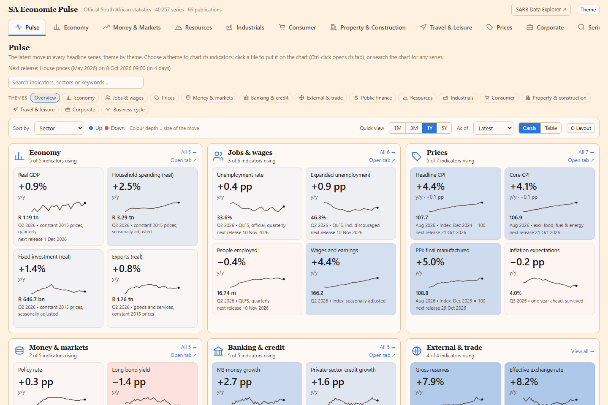
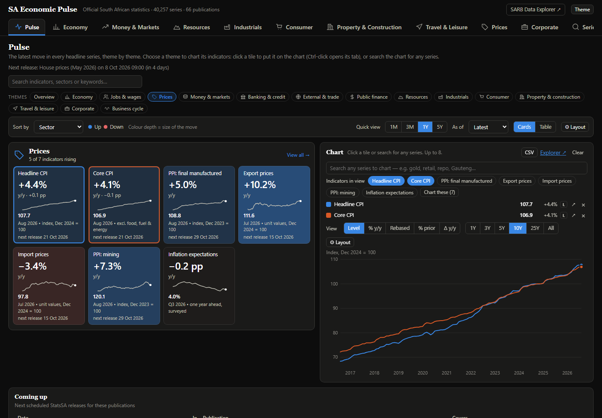

# SA Economic Pulse

An interactive dashboard of the **South African economy**: GDP and what drives it, inflation,
jobs and wages, interest rates, the rand, credit, trade, public finance, mining, manufacturing,
retail, property, tourism and company finances. More than **40,000 official series** from
**Statistics South Africa** and the **South African Reserve Bank**, charted, compared and kept up to
date. Companion project to the [SARB Data Explorer](https://sarb.metiscore.space) and the SA CPI dashboard.

**Live on the web: https://sa-macropulse.n-preneshen.workers.dev**


*Pulse overview: the four key indicators of each theme, coloured by the size and direction of the latest move.*


*Pick a theme to chart its indicators, or search any of the 40,000 series. Shown in the dark theme.*

Plain HTML, CSS and JavaScript: no build step, no framework, no server of its own. The data ships
with the site as script files, so it opens straight from disk or from any static host.

```
SA Economic Pulse/
├── index.html               the page (script tags only, so file:// works)
├── css/app.css              styles, light / dark, the Theme panel
├── js/                      the app: kit.js (store, charts, tables), one file per tab,
│                            feeds.js (live Reserve Bank series), appearance.js (Theme panel)
├── data/
│   ├── manifest.js          what is loaded, release calendar, parse report
│   ├── P*.js                one file per Statistics South Africa publication (parsed workbooks)
│   └── live/                the Reserve Bank history, in four part files + an index
├── tools/                   updater, parser, audits, catalogue / snapshot builders
├── docs/                    the two screenshots above
├── favicon.svg, og-image.png, robots.txt, sitemap.xml, site.webmanifest
├── README.md  SOURCES.md  LICENSE.txt  NOTICE.txt
└── (source-data/, backups/)  created on your PC by the updater; not in the repository
```

## What's in it

| Tab | Contents |
|---|---|
| **Pulse** | The overview: the four key indicators of each of 14 themes (Economy, Jobs & wages, Prices, Money & markets, Banking & credit, External & trade, Public finance, Resources, Industrials, Consumer, Property, Travel, Corporate, Business cycle) as colour-coded tiles with sparklines, a 1M / 3M / 1Y / 5Y quick view and an "as of" month. Pick a theme to open all its tiles beside a **chart workspace**: click a tile or search any series to chart it, change the view (level, % y/y, rebased), range, chart style, axes and layout. |
| **Economy** | GDP growth and what drove it (by industry and by type of spending; both add up to GDP growth), provincial GDP, jobs and pay (QLFS, QES), investment (QCE, public-sector capex), government finance, municipal finance and census, and the business cycle |
| **Money & Markets** | Policy and market rates, T-bills, bond yields (daily as well as monthly), the rand and gold, money and credit, deposits, the balance of payments, reserves, the international investment position, public finance, and the money-market desk's notices |
| **Resources, Industrials, Consumer, Property & Construction, Travel & Leisure, Corporate** | The Statistics South Africa sector releases: mining, manufacturing, electricity and transport, retail / motor / wholesale / food, building plans and house prices, tourist accommodation, liquidations, insolvencies and company finances |
| **Prices** | CPI (headline, core, trimmed mean, divisions, products, provinces, household baskets), PPI, trade prices, and rand prices of everyday products, with the inflation target band |
| **Series Explorer** | Every series, searchable, with filters, a formula bar (`a-b`, `100*a/b`), left / right axes, per-series views, CSV export and shareable links |
| **Data & Update** | What is loaded and how fresh it is, the release calendar, a coverage audit, the live-series status |

Every chart has a crosshair tooltip, a table view, **PNG export (with title, legend and source)** and
CSV. Frequently updated charts come first on every tab; annual and older data sit below them.
The **Theme** button opens a panel: light / dark, page styles, colour palettes (or your own eight
colours), graph layout themes, spacing, corners, text size, headings and heat-colour strength.
Everything is remembered in your browser.

## How data flows

Two layers:

1. **Statistics South Africa** (37 publications, [SOURCES.md](SOURCES.md)): StatsSA only publishes
   Excel workbooks, and its site blocks scripted requests, so `tools/Update-Data.ps1` fetches each
   new release through a minimised Edge window, unpacks it into a staging copy, parses it with
   `tools/Parse-StatsSA.ps1` and swaps it in only if every check passes. The result is `data/P*.js`.
2. **South African Reserve Bank** (518 series in 30 publications: rates, the rand, money and credit,
   the balance of payments, public finance, the IMF SDDS tables, business-cycle indicators): the Reserve
   Bank's public Web API allows cross-site requests, so the page reads it directly. The full history is
   built into `data/live/` (`tools/Build-FeedCatalog.py` lists the series, `tools/Build-FeedSnapshot.py`
   downloads them) and loaded in parts only when a tab needs them; the browser then **tops up only
   what is newer** and keeps it in IndexedDB. Daily series (rates, FX) are real daily publications.

## The updater

```powershell
.\tools\Update-Data.ps1               # download + parse whatever is due now
.\tools\Update-Data.ps1 -CheckOnly    # just report what is due (no network)
.\tools\Update-Data.ps1 -Force -Only P2041   # re-download one publication (tests the pipeline)
.\tools\Update-Data.ps1 -Install      # weekdays 09:15, every 30 minutes for 7 hours
.\tools\Update-Data.ps1 -Uninstall    # remove the task
.\tools\Restore-Snapshot.ps1 -List          # roll back to a safety copy
```

`tools\schedule-seed.json` lists the scheduled releases; a publication is *due* when a release dated on
or before now covers a period later than the data held, so a run on a quiet day makes no network
request at all. Safety net: new files must keep (nearly) all existing series, periods and cells and
advance the latest period; a snapshot is taken before every swap (last 5 kept) and put back
automatically if a later audit fails; a rejected file is remembered by hash so it is not retried every
30 minutes. `tools\Update-Calendar.ps1` keeps the release calendar in step with StatsSA's own page.

The raw Excel downloads (`source-data\`, about 64 MB) are not in the repository. To rebuild them on a new
machine, run `tools\Download-Scoping.ps1` (the current file of each publication), then
`Download-Batch2.ps1`, `Download-Census.ps1`, `Download-Municipal.ps1` and `Download-Prices.ps1` for the rest,
and `tools\Parse-StatsSA.ps1` to regenerate `data\`. From then on the updater keeps everything current.

Requirements: Windows PowerShell 5.1, Microsoft Edge, and Python 3 for the catalogue / snapshot builders
and the audits (`tools\Validate-Parse.py`, `Audit-Integration.py`, `Check-Accuracy.py`).

## Run it

```powershell
git clone https://github.com/npreneshen/sa-economic-pulse.git
cd sa-economic-pulse
start index.html                  # or: python -m http.server 8000   and open http://localhost:8000
```

The repository contains the parsed data, so nothing needs downloading to look around. The live
Reserve Bank layer needs an internet connection; the Statistics South Africa data works offline.
To refresh the Reserve Bank history in `data/live/`: `python tools\Build-FeedSnapshot.py`.
Any static host will serve the folder as it is.

## Reserve Bank Web API endpoints used

Base: `https://custom.resbank.co.za/SarbWebApi`

| Endpoint | Data |
|---|---|
| `WebIndicators/Shared/GetTimeseriesObservations/{code}/{from}/{to}` | full history of any series code |
| `WebIndicators/ReleaseOfSelectedData` | the release register (which releases moved) |
| `WebIndicators/HomePageRates`, `CurrentMarketRates`, `CPDRates` | rates boards |
| `WebIndicators/HistoricalExchangeRatesDaily` / `Monthly` | exchange-rate boards |
| `WebIndicators/EconFinDataForSA/*` | the IMF SDDS tables |
| `MCM/Categories`, `MCM/Contributions/{id}` | money-market desk notices |

Reserve Bank values arrive as South African locale strings in some archives (comma decimal, non-breaking
space thousands); the code normalises them before parsing.

## Derived analyses

Year-on-year and period changes, rolling sums and averages, contributions to growth (they add up to the
published total, including the national accounts' residual item), real rates, shares, rankings and indexed
comparisons are computed in the page from published series. They are descriptive statistics, not forecasts
and not advice.

## License and credit

Licensed under the **Apache License 2.0** (see [LICENSE.txt](LICENSE.txt)). Copyright 2026
Preneshen Naicker. If you use, fork or redistribute this project, please keep [NOTICE.txt](NOTICE.txt) and
credit "SA Economic Pulse by Preneshen Naicker" (https://github.com/npreneshen/sa-economic-pulse).

Data © Statistics South Africa and the South African Reserve Bank, each under its own terms of use
([SOURCES.md](SOURCES.md)). This is an independent viewer; it is not affiliated with or endorsed by either
institution.
